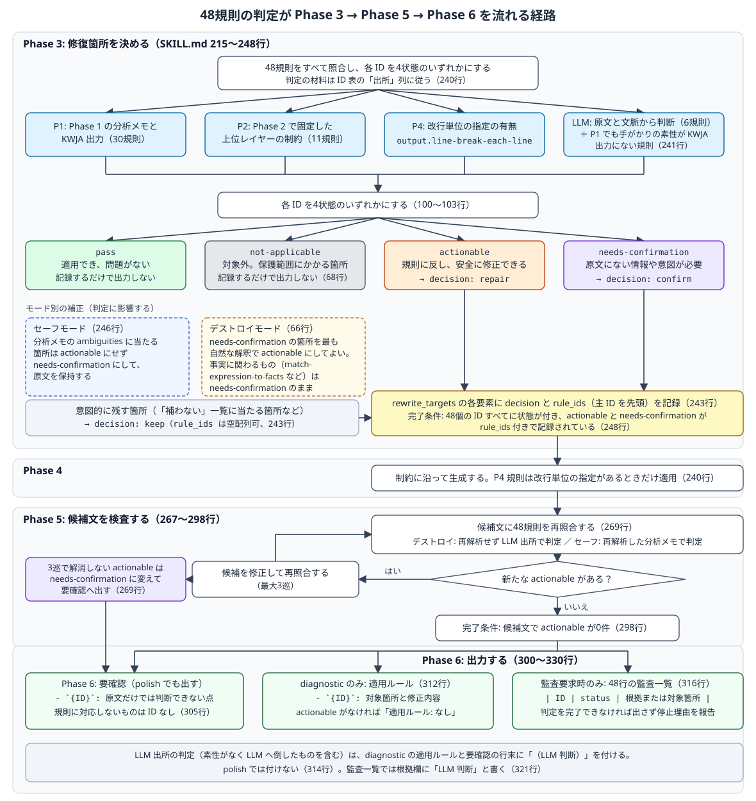
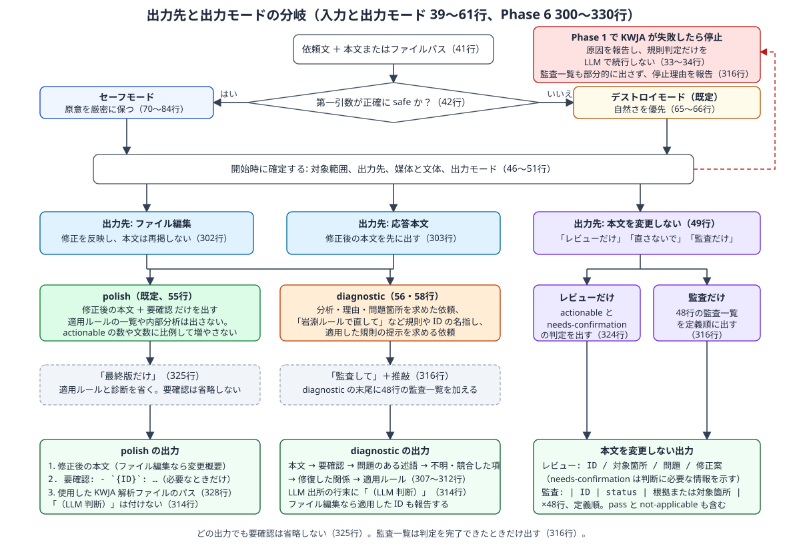

= 岩淵48規則の natural-japanese-rewriter への統合 レビューガイド
:toc: left
:toclevels: 3
:sectnums:

== 3分で分かる変更概要

=== 何が変わったか

日本語を自然に書き直すスキル `natural-japanese-rewriter` に、別スキル `rewrite-japanese-with-iwabuchi-rules` が持っていた「岩淵48規則」を取り込み、旧スキルを削除した。
スキルとはプログラムではなく、LLM エージェントが上から読んで従う手順書（`SKILL.md`）である。したがって、この変更でレビューするのはコードではなく「エージェントへの指示文」である。

変更後の `natural-japanese-rewriter/SKILL.md` は209行から330行になった。このスキルは Phase 1〜6 という6つの作業段階で進み、Phase 1 で KWJA（京都大学の日本語解析器）に文を解析させ、その結果を「分析メモ」という YAML にまとめてから直す。増えた主な内容は次の4つである。

. 48規則の ID 表（`## 岩淵48規則の ID 表`）。旧スキルの表に「上位概念」「主な手がかり」「出所」の3列を足した。
. Phase 3 で48規則を4つの状態（`pass` / `not-applicable` / `actionable` / `needs-confirmation`）に判定し、直す候補の一覧 `rewrite_targets` に `decision` と `rule_ids` を記録する手順。
. Phase 5 で書き直した文にもう一度48規則を当て直す手順（最大3巡）。
. Phase 6 で `要確認` に ID を付け、`diagnostic` モードで「適用ルール」を出し、求められたときだけ48行の監査一覧を出す手順。

あわせて、旧スキルのトリガー語（「岩淵ルールで直して」など）を `description` に移し、`agents/openai.yaml` の説明文を更新した。

=== なぜ変えたか

旧スキルは48規則を文章に直接照合するチェックリストで、`natural-japanese-rewriter` は KWJA の解析結果（文を単語、係り受け、述語と項に分解したもの）をもとに文を直すパイプラインだった。両者は同じ悪文を別の語彙で扱っていたため、同じ判断が二重になり、規則 ID と KWJA の根拠が結びつかなかった。
要件定義書は、48規則を「文字列に照らす項目」ではなく「分析メモと上位レイヤーのどの観測から判定する規範か」として内蔵し、旧スキルを削除して単独で完結させることを求めている（要件定義書「目的」）。

=== どこに影響するか

* 影響する: `natural-japanese-rewriter` を起動するすべての依頼。既定のデストロイモードでも内部で48規則を照合し、確定できない点だけを ID 付きの `要確認` で返すようになる。
* 影響する: 旧スキルの利用者。同じ依頼文で `natural-japanese-rewriter` が起動するが、既定がデストロイモード（自然さ優先、細部の意味変更を許容）になる。原意を保ちたい場合は第一引数に `safe` が必要になる。
* 影響しない: 子スキル `natural-japanese-rewrite-analyzer` と `japanese-kwja-analyze`（差分なし）、`references/detailed-rules.md`、`manifest.json`。

=== レビュー対象の特定

レビュー対象は、実装計画のチェックポイント `8845b02` から最終コミットまでの `main` 上の差分である。実装はコミット `26af043`（`日本語スキルアップデート`）で入り、レビュー3巡目の修正はコミット `d5373b1` 以降に入った。行番号はすべて最終版の `SKILL.md`（330行）を指す。

[cols="3,1,3",options="header"]
|===
|パス
|種別
|内容

|`skills/natural-japanese/natural-japanese-rewriter/SKILL.md`
|更新
|209行から330行。description、出力モード、リライトの優先順位、ID 表の新設、Phase 3・5・6

|`skills/natural-japanese/natural-japanese-rewriter/agents/openai.yaml`
|更新
|`short_description` の1行（87文字）

|`skills/natural-japanese/rewrite-japanese-with-iwabuchi-rules/SKILL.md`
|削除
|旧スキル本体（172行）

|`skills/natural-japanese/rewrite-japanese-with-iwabuchi-rules/agents/openai.yaml`
|削除
|旧スキルの Codex 向け説明

|`docs/requrements/2026_09_29_natural_japanese/req-2026_09_29_natural_japanese.adoc`
|更新
|FR-03 の手がかり1件、FR-04、FR-05、FR-06、FR-07、D-07、例外、T-07、T-08 の明確化（レビュー2巡と検証ワークフロー1巡で見つかった矛盾の解消）

|`docs/requrements/2026_09_29_natural_japanese/implementation-plan-issueX-2026_09_29_natural_japanese.adoc`
|更新
|Task 1〜9 の状態、「実装結果と検証結果」節の記入（レビュー3巡の記録、計画からの調整、採らなかった指摘）

|同ディレクトリの `req-*.html`、`implementation-plan-*.html`、`easy-implementation-plan-*.html`
|追加
|上記2文書の HTML 生成物と、実装計画の解説 HTML
|===

=== レビュー3巡目で確定した変更

実装後のレビューは `ponytail-review` 2巡と、要件照合・実行シミュレーション・構造検査の3系統に懐疑者2名ずつを付けた検証ワークフロー1巡の計3巡で、3巡目は本文を変更しない出力先（レビューだけ、監査だけ）の扱いを中心に次を確定した。いずれも要件定義書へ先に反映してから `SKILL.md` へ反映している（実装計画「計画からの調整」）。

* `SKILL.md` 66行: デストロイモードで `要確認` に残す基準を「原文にない主体、対象、動作主、原因、目的、数値、時刻、確実性を確定させる解釈は選ばない」と定義し、該当 ID の例に `sentence.state-changed-subject-explicitly` と `sentence.minimize-passive-voice` を加えた。本文を変更しない出力先ではこの扱いを行わず、Phase 3 の判定をそのまま出す。
* 144行: `word-choice.avoid-roundabout-phrasing` の「主な手がかり」から `detailed-rules.md` への参照を外し、「適切に」を例に加えた。
* 241行: `LLM` 出所の判定は `rule_ids` に記録し、KWJA 由来のフィールドには書き込まない。
* 243行: 要素の追記主体を親スキルと明記。規則違反がない自然さ目的の書き直しも `decision: repair`、`rule_ids: []` で記録する。本文を変更しない出力先では `repair` は修正案の提示を意味し、`confirm` は監査一覧または判定行に含める。`pass` と `not-applicable` は監査一覧を除き出力しない。
* 246行: セーフモードの `ambiguities` 判定は修復トリガーより優先する。
* 269行: 再照合で検出・修正した項目も適用ルールに載せる。本文を変更しない出力先では Phase 3 で判定を終え、再照合は行わない。
* 316行: 監査だけの出力は監査一覧と解析ファイルのパスだけ。`要確認` の別掲と診断は出さず、判断に必要な情報と `LLM` 出所の表示は3列目に書く。
* 324〜325行: レビューだけは1件1行の `ID / 対象箇所 / 問題 / 修正案`、修正案は Phase 4 の生成方針で作り、`LLM` 出所の行に `（LLM 判断）` を付ける。最終版だけは解析ファイルのパスも省く。

図2の「本文を変更しない」列は、この確定内容（Phase 5 を通らず Phase 3 の判定を出す）に合わせて読む。

=== 対象外

* 旧スキルの stub や alias（作らない方針。要件 D-06）
* `references/detailed-rules.md` への規則 ID の注記（任意の FR-09 は不実施。計画 P-11）
* README のスキル一覧、利用環境の nix 再ビルド

== 最初に読む root

root とは、この変更を理解し始める入口のファイルと節のことである。

主 root:: `skills/natural-japanese/natural-japanese-rewriter/SKILL.md` の `## 岩淵48規則の ID 表`（94〜173行）。
ここに4状態の定義（100〜103行）、出所 `P1` / `P2` / `P4` / `LLM` の意味（105行）、48行の表がある。Phase 3・5・6 の追記はすべてこの表の語彙で書かれているため、先にここを読むと残りが読める。

補助 root 1:: 同ファイルの `## Phase 3: 修復箇所を決める`（215〜248行）。48規則の判定と `rewrite_targets` への記録が起こる唯一の場所である。

補助 root 2:: 要件定義書 `req-2026_09_29_natural_japanese.adoc` の FR-04〜FR-07。SKILL.md の各追記がどの要件に対応するかを照合するときに使う。

== 推奨する読解順

[cols="1,3,4",options="header"]
|===
|順
|パスと節（行）
|確認する目的

|1
|`natural-japanese-rewriter/SKILL.md` frontmatter `description`（3〜15行）
|旧スキルのトリガー語が入り、除外文が消えているか。`safe` の説明と「岩淵ルールでの推敲も既定はデストロイモード」の注意が読めるか

|2
|同 `## 岩淵48規則の ID 表`（94〜173行）
|ID の綴りが旧スキルと同じか。4状態と出所の定義が一意に読めるか。「主な手がかり」が分析メモの実フィールド名になっているか

|3
|同 `## 入力と出力モード`（39〜61行）
|出力先に「本文を変更しない」が増えたこと、`polish` が本文と `要確認` だけを出すこと、規則や ID を名指しする依頼が `diagnostic` になること

|4
|同 `## リライトの優先順位`（63〜92行）
|デストロイモードで規則を「自然さの判定基準」として使う位置づけ（65〜66行）、保護範囲と `not-applicable` の関係（68行）、セーフモードの追加項目（79行）、規則衝突時の順序（86〜92行）

|5
|同 `## Phase 3`（215〜248行）
|48規則の判定、素性がないときの `LLM` 出所への倒し方（241行）、`rewrite_targets` の `decision` と `rule_ids`（243行）、セーフモードの `ambiguities` の扱い（246行）、完了条件（248行）

|6
|同 `## Phase 5`（267〜298行）
|両モード共通の再照合（269行）、最大3巡、解消しない `actionable` の行き先、完了条件（298行）

|7
|同 `## Phase 6`（300〜330行）
|`要確認` の書式（305行）、適用ルール（312行）、`（LLM 判断）` の付与（314行）、監査一覧（316〜322行）、レビューだけと最終版だけ（324〜325行）、完了条件（330行）

|8
|`natural-japanese-rewriter/agents/openai.yaml`（3行）
|既定がデストロイモードであることと、ルール ID 付きの診断・監査ができることが1文で読めるか。旧スキル名が入っていないか

|9
|削除された `rewrite-japanese-with-iwabuchi-rules/SKILL.md`（バックアップ `docs/backups/2026_09_29/natural-japanese/rewrite-japanese-with-iwabuchi-rules/SKILL.md`）
|移し忘れがないか。最優先原則、ID の扱い、作業手順、出力形式、完了条件が新 SKILL.md のどこに対応するかを追う

|10
|実装計画 `implementation-plan-issueX-2026_09_29_natural_japanese.adoc` の「実装結果と検証結果」節
|検証結果と、レビュー2巡で直した7つの矛盾、計画からの調整3件
|===

== 実行時フロー

エージェントが `SKILL.md` を上から実行するときの流れである。行番号は `natural-japanese-rewriter/SKILL.md` のものである。

入力:: 依頼文と、リライト対象の日本語テキストまたはファイルパス（41行）。

モード決定:: 第一引数が正確に `safe` のときだけセーフモード。それ以外はデストロイモード（42行）。開始時に対象範囲、出力先（ファイル編集、応答本文、本文を変更しない）、媒体と文体、出力モード（`polish` / `diagnostic`）を確定する（46〜58行）。

Phase 1:: 子スキルで KWJA を実行し、分析メモ（analyzer が出す YAML。述語、項、指示対象、曖昧さなどを持つ）を作る（175〜189行）。
早期終了: 必要なスキルが見つからない、KWJA の実行や解析ファイルの読み取りに失敗した場合は、リライトを止めて原因を報告する。規則の判定だけを LLM で続けない（33〜34行）。

Phase 2:: 談話構造、情報構造、語用論、対人関係、文体の制約を固定する（191〜213行）。変更なし。

Phase 3:: 修復箇所を決める。ここで48規則をすべて照合し、各 ID を4状態にする（240〜241行）。`actionable` は `decision: repair`、`needs-confirmation` は `decision: confirm`、意図的に残す箇所は `keep` として `rewrite_targets` に `rule_ids` 付きで記録する（243行）。セーフモードでは曖昧な箇所を `actionable` にしない（246行）。

Phase 4:: 制約に沿って生成する（250〜265行）。変更なし。`P4` の規則 `output.line-break-each-line` は、改行単位の指定があるときだけここで適用する（240行）。

Phase 5:: 候補文に48規則を再照合し、新たな `actionable` があれば修正して再照合する。最大3巡で解消しない `actionable` は `needs-confirmation` に変えて `要確認` に出す（269行）。セーフモードは従来の意味回帰検査（KWJA で候補文を再解析し、意味のずれを `SEMANTIC_DRIFT` として棄却する）も行う（273〜296行）。

Phase 6:: 出力先と出力モードに応じて、本文、`要確認`、適用ルール、監査一覧を出す（300〜330行）。

外部 I/O:: KWJA の実行と解析ファイルの読み書き（子スキル経由）、対象ファイルの編集（ファイル編集が出力先のときだけ）。ネットワークやデータベースはない。

== 難しい処理

=== 48規則の判定が Phase 3 → 5 → 6 を流れる経路

.48規則の判定が Phase 3 で決まり、Phase 5 で再照合され、Phase 6 で3種類の出力になるまでの流れ。モード別の補正と `（LLM 判断）` の付与を含む

入力:: Phase 1 の分析メモ、Phase 2 の制約、原文、ユーザーの依頼（改行単位の指定の有無など）。

判断:: 各規則を、ID 表の「出所」列が示す材料で判定する。`P1`（30規則）は分析メモと KWJA 出力、`P2`（11規則）は Phase 2 で固定した制約、`P4`（1規則）は改行単位の指定の有無、`LLM`（6規則）は原文と文脈である。出所が `P1` でも、手がかりの素性が KWJA 出力にない規則は `LLM` 出所として判定し、その旨を記録する。素性がないことを理由に `not-applicable` にはしない（241行）。

正常時の結果:: 48個の ID すべてに状態が付き、`actionable` と `needs-confirmation` が `rewrite_targets` に `rule_ids` 付きで記録される（248行）。Phase 5 の再照合で `actionable` が0件になる（298行）。Phase 6 では `要確認` が ``- `+{ID}+`: {原文だけでは判断できない点}`` の形で出る（305行）。

失敗時の結果:: Phase 5 で3巡しても `actionable` が残る場合は `needs-confirmation` に変えて `要確認` に出す（269行）。Phase 3 より前に停止した場合は、監査一覧を部分的に出さず停止理由を報告する（316行）。

不変条件::
* ID は表の48個だけを使い、省略、改名、再利用しない（96行）。
* `pass` と `not-applicable` は記録するだけで出力しない（243行）。
* コード、コマンド、ファイルパス、API 名などの保護範囲は両モードで守り、保護範囲にかかる箇所への判定は `not-applicable`、保護範囲の外には同じ規則を通常どおり適用する（68行）。
* `needs-confirmation` はどの出力でも省略しない（325行）。

設計上の判断::
* 判定を Phase 3 に集約し、Phase 5 は再照合、Phase 6 は出力だけを担う（要件 D-01、非機能要件「保守性」）。
* `rewrite_targets` の要素形（`decision`、`rule_ids`）は親スキルが定める記録で、analyzer の出力契約は変えない（要件 D-04）。
* デストロイモードは候補文を KWJA で再解析しないため、Phase 5 の再照合は `LLM` 出所で行う。セーフモードは意味回帰検査で再解析した分析メモを使う（269行、要件 FR-06）。

=== 出力先と出力モードの分岐

.依頼文からモード、出力先、出力モード、追加要求（最終版だけ、監査して）を決め、何を出力するかが決まるまでの分岐

入力:: 依頼文（「自然にして」「岩淵ルールで直して」「監査して」「レビューだけ」「最終版だけ」など）と本文。

判断::
* 出力先は3つ。ファイル編集、応答本文、本文を変更しない（49行）。「本文を変更しない」は「レビューだけ」「直さないで」「監査だけ」の依頼である。
* 出力モードは2つのまま。`polish`（既定）と `diagnostic`（56行）。規則や ID を名指しする依頼と、適用した規則の提示を求める依頼は `diagnostic` として扱う（58行）。出力モードは増やさない（要件 D-07）。
* 「最終版だけ」は適用ルールと診断を省くが `要確認` は省略しない（325行）。「監査して」は監査だけなら本文を変えず、推敲もなら `diagnostic` の末尾に48行を加える（316行）。

正常時の結果::
* `polish`: 修正後の本文（ファイル編集なら本文を再掲せず変更ファイルと変更概要）、必要なときだけ `要確認`、使用した KWJA 解析ファイルのパス（302〜305行、328行）。適用ルールの一覧、内部分析、`（LLM 判断）` は出ない（55行、314行）。
* `diagnostic`: 本文と `要確認` に加えて、問題のある述語、不明または競合していた項、修復で明確になった関係、適用ルール（307〜312行）。`LLM` 出所の行末に `（LLM 判断）` を付ける（314行）。
* レビューだけ: 本文を変えず、`actionable` と `needs-confirmation` の判定を `ID / 対象箇所 / 問題 / 修正案` で出す（324行）。
* 監査: 規則の定義順に48行の表を出す（318〜322行）。`pass` と `not-applicable` も含む。

失敗時の結果:: Phase 1 で KWJA が失敗すれば停止し、規則判定だけを LLM で続けない（33〜34行）。監査一覧も部分的には出さない（316行）。

=== 図を作らなかった変更

旧ディレクトリ `rewrite-japanese-with-iwabuchi-rules/` の削除は単純な削除で、分岐や状態遷移がないため図は作っていない。移し忘れの確認は「推奨する読解順」の9番と「重点チェック」で行う。

== 重要コードの解説

ここでの「コード」は `SKILL.md` の節である。行番号は `skills/natural-japanese/natural-japanese-rewriter/SKILL.md` のものである。

=== frontmatter `description`（3〜15行）

責務:: どの依頼でこのスキルが起動するかを決める。エージェントはこの文でスキルを選ぶ。
入力:: ユーザーの依頼文。
出力:: 起動の可否。
変更点:: 旧スキルのトリガー語「岩淵ルールで直して」「48規則で悪文をチェックして」「ルールID付きで推敲して」「文の組み立て・用語・敬語を網羅的に点検して」「監査して」を加え、「岩淵ルールでの推敲も既定はデストロイモードで、原意を保つには safe を付ける」を明記した。旧スキルにあった除外文（「一般的な『悪文をチェックして』『校正して』『自然にして』『読みやすくして』だけの依頼には使わない」）は引き継いでいない。文字数は458（上限1024）。
副作用:: 旧スキルの削除後、これらの依頼はこのスキルだけが受ける。利用環境に旧スキルが残っていれば2つが反応し得る（「既知の制約」を参照）。

=== `## 入力と出力モード`（39〜61行）

責務:: モード、出力先、出力モードの決定。
変更点:: 出力先に「本文を変更しない（レビューだけ、監査だけ）」を加えた（49行）。`polish` を「修正後の本文と `要確認` を出し、適用した規則の一覧や内部分析は出さない。`actionable` の数や文数に比例して出力を増やさない」と定義し直した（55行）。`diagnostic` に「適用した規則 ID」を加えた（56行）。規則や ID を名指しする依頼を `diagnostic` とする判定を置いた（58行）。1〜2文や UI 文言でも48規則の照合は変えず、`not-applicable` を素早く済ませる（60行）。

=== `## リライトの優先順位`（63〜92行）

責務:: モードごとに、規則をどの強さで適用するかを決める。
変更点::
* デストロイモード（66行）: 48規則は自然さの判定基準として使い、`actionable` の判定と修正もデストロイモードが許容する意味変更の範囲で行う。`needs-confirmation` の箇所はもっとも自然な解釈を選んで `actionable` として扱ってよいが、事実に関わるもの（`word-choice.match-expression-to-facts` など）は `needs-confirmation` のまま `要確認` に残す。
* 保護範囲（68行）: 規則を理由に保護範囲を変えない。保護範囲にかかる箇所は `not-applicable`、外の箇所には同じ規則を通常どおり適用する。
* セーフモード（79行）: 「規則を機械的に適用せず、読みやすさや正確さが実際に上がる変更だけを採用する」を追加した（旧スキルの最優先原則から移した）。
* 規則衝突時の順序（86〜92行）: 原意の保持、文脈・係り受け・否定範囲・用語の正確さ、明確さ、語感・敬語・簡潔さ、行配置の5段階。両モード共通だが、デストロイモードでは自然さ最優先を上位に置く。Phase 4 の優先順位（生成時の制約）とは別物であると明記している。

=== `## 岩淵48規則の ID 表`（94〜173行）

責務:: 規則の定義と、それを判定する材料の指定。
構成:: 導入（96〜105行）と4つのカテゴリ表。列は `ID`、`規則`、`上位概念`、`主な手がかり`、`出所` の5列。行数は `output` 1、`sentence` 21、`word-choice` 16、`honorific` 10 の計48。
上位概念:: 規則を判定する観測の層。`述語項構造` 7、`係り受け` 8、`節構造・談話関係` 5、`共参照・照応` 1、`形態素・語彙` 9、`固有表現・保護範囲` 1、`語用論・モダリティ` 3、`対人関係` 8、`文体` 5、`文書構造` 1（このガイド生成時に集計）。
出所:: `P1` 30、`P2` 11、`P4` 1、`LLM` 6。
規則本文:: 旧スキルの一文をそのまま移した。例外は `output.line-break-each-line` の「指定がなければ `needs-confirmation` とし」を `not-applicable` に置き換えた1か所だけ（111行。要件 D-08）。

=== `## Phase 3: 修復箇所を決める`（215〜248行）

責務:: 直す箇所の決定と、48規則の判定・記録。
変更点:: 240〜243行、246行、248行。既存の修復トリガー一覧（220〜229行）と非トリガー一覧（233〜238行）は変えず、規則の判定はこれらを ID で言い換える位置づけである（要件 FR-04）。
`rewrite_targets`:: 分析メモの「直す候補の一覧」。analyzer は空配列で渡し（`natural-japanese-rewrite-analyzer/SKILL.md` 90行 `rewrite_targets: []`）、親スキルであるこの Phase 3 が埋める。各要素は少なくとも `decision`（`repair` / `keep` / `confirm`）と `rule_ids`（主 ID を先頭、関連 ID を続ける。空配列可）を持つ。

=== `## Phase 5: 候補文を検査する`（267〜298行）

責務:: 生成した候補文の検査。
変更点:: 冒頭に両モード共通の再照合を置いた（269行）。デストロイモードは候補文を再解析しないため `LLM` 出所で判定し、セーフモードは意味回帰検査で再解析した分析メモを使う。再照合は最大3巡。完了条件に「候補文で `actionable` の規則が0件」を加えた（298行）。既存の意味回帰検査（273〜296行）は変えていない。

=== `## Phase 6: 出力する`（300〜330行）

責務:: 出力先と出力モードに応じた出力。
変更点:: ファイル編集時に本文を再掲せず変更ファイル、変更概要、`要確認` を報告する（302行）。`要確認` の書式（305行）。`diagnostic` の4項目目に適用ルール（312行）。`（LLM 判断）` の付与（314行）。監査一覧の条件と書式（316〜322行）。レビューだけと最終版だけ（324〜325行）。完了条件を「出力先に応じてリライト本文、判定、または監査一覧が出力され」に改めた（330行）。

=== `agents/openai.yaml`（3行）

責務:: Codex 側に表示するスキルの短い説明。
変更点:: `short_description` を「README、仕様書、PR説明文、UI文言などの日本語を、既定では自然さを優先して大胆に書き直し、safe 指定で原意を保つ。岩淵48規則のルールID付きで診断・監査もできる」（87文字）に差し替えた。`display_name` は維持、`default_prompt` は追加していない。YAML として読み込めることを確認した。

=== 削除した旧スキル

`rewrite-japanese-with-iwabuchi-rules/SKILL.md`（172行）と `agents/openai.yaml`（4行）を削除した。旧スキルの内容と新 SKILL.md の対応は次のとおり。

[cols="2,3",options="header"]
|===
|旧スキルの節
|新 SKILL.md での対応

|最優先原則（20〜24行）
|セーフモードの箇条書き（72〜79行）と、両モード共通の保護範囲（68行）

|衝突時の順序（26〜32行）
|規則衝突時の順序（86〜92行）

|ID の扱い（34〜46行）
|ID 表の導入（96〜103行）

|作業手順（48〜60行）
|Phase 1〜6。「このスキルは単独で実行する」は引き継がない（要件「保守性」）

|4カテゴリの ID 表（62〜128行）
|ID 表（107〜173行）。3列を追加

|出力形式（130〜163行）
|Phase 6（302〜325行）

|完了条件（165〜172行）
|Phase 3、5、6 の完了条件（248行、298行、330行）
|===

== テストとの対応

この変更には自動テストがなく、要件定義書「受け入れ条件」の AC-01〜AC-18 と「検証シナリオ」の T-01〜T-15 で確認する。実装計画の「検証コマンドの結果」に実装時の結果があり、このガイドの生成時にも同じ検査を再実行した。

[cols="1,4,3",options="header"]
|===
|AC
|内容
|結果（計画の記録 / このガイド生成時の再確認）

|AC-01
|ID 表に ID 行がちょうど48行、`output` 1、`sentence` 21、`word-choice` 16、`honorific` 10、重複なし
|PASS / 再確認 PASS（48、1・21・16・10、重複0）

|AC-02
|48 ID の集合がバックアップ `docs/backups/2026_09_29/natural-japanese/rewrite-japanese-with-iwabuchi-rules/SKILL.md` と完全一致
|PASS / 再確認 PASS。集合だけでなく順序も一致。規則本文の差は `output.line-break-each-line` の1か所だけ

|AC-03
|48行すべてに上位概念（10種のいずれか）と出所（4種のいずれか）
|PASS / 再確認 PASS（`rows=48 bad=[]`）

|AC-04
|旧ディレクトリが存在しない
|PASS / 再確認 PASS

|AC-05
|`skills/` 配下の追跡ファイルに旧スキル名が0件
|PASS / 再確認 PASS（0件）

|AC-06
|`description` に「岩淵ルール」「48規則」「ルールID」「監査」を含み、除外文を含まない
|PASS / 再確認 PASS（4語あり、除外文0件）

|AC-07
|`name` が `natural-japanese-rewriter` のまま、`description` が1024文字以内
|PASS（458文字） / 再確認 PASS

|AC-08
|skill-creator の `quick_validate.py` を通過
|PASS / 再確認 PASS（`Skill is valid!`）

|AC-09
|SKILL.md が400行以下
|PASS（330行） / 再確認 PASS（330行）

|AC-10
|analyzer と `japanese-kwja-analyze` に差分がない
|PASS / 再確認 PASS（`git diff --stat` 出力なし）

|AC-11
|`manifest.json` の列挙とディレクトリ内の配布ファイルが一致
|PASS（`missing=[] unlisted=[]`） / 再確認: 列挙された3ファイルが存在し、未列挙は `manifest.json` 自身だけ

|AC-12
|Phase 3 に4状態判定、`decision` と `rule_ids`、`needs-confirmation` から `要確認` への経路
|レビュー PASS / 240〜248行で確認

|AC-13
|Phase 5 に両モード共通の再照合と `actionable` 0件の完了条件
|レビュー PASS / 269行、298行で確認

|AC-14
|Phase 6 に ID 付き `要確認`、適用ルール、要求時のみの監査一覧、レビューだけと最終版だけ
|レビュー PASS / 305行、312行、316〜325行で確認

|AC-15
|規則衝突時の優先順位とデストロイモードでの規則の位置づけ
|レビュー PASS / 65〜66行、86〜92行で確認

|AC-16
|`output.line-break-each-line` の既定が `not-applicable`
|PASS（旧文言0、新文言1） / 再確認 PASS

|AC-17
|`short_description` が既定のデストロイモードと ID 付き診断に言及し、旧スキル名を含まない
|PASS / 再確認 PASS（YAML 読み込み可、87文字）

|AC-18
|FR-09 を実施した場合の注記 ID の整合
|該当なし（FR-09 不実施） / 同じ
|===

検証シナリオ T-01〜T-15 は、実装計画「検証シナリオの対応表」の記述をスキル指示のレビューで確認したものである。T-03、T-10、T-12、T-14 は KWJA の実行を伴うが、モデル重み未取得のため実行しておらず、レビュー確認にとどまる（計画「検証シナリオのレビュー結果」）。

要件定義書と実装計画は `asciidoctor --failure-level WARN` で警告がないことを完了条件にしている（計画「完了条件」）。

== 重点チェック

各項目は、レビュアーが判断する問いと、見落とすと何が壊れるかを示す。

=== 48 ID の綴りがバックアップと一致するか

問い:: `## 岩淵48規則の ID 表` の48個の ID は、`docs/backups/2026_09_29/natural-japanese/rewrite-japanese-with-iwabuchi-rules/SKILL.md` の ID と綴り、件数、順序が一致しているか。規則本文の差は `output.line-break-each-line` の `needs-confirmation` → `not-applicable` の1か所だけか。
確認結果:: このガイド生成時の照合では、集合と順序が一致し、規則本文の差は111行の1か所だけだった。
壊れるもの:: 過去の出力に残る ID が新しい表で引けなくなる。監査一覧や `要確認` の ID が旧スキルの利用者の記録と食い違う。要件の非機能要件「ID の安定性」に違反する。

=== デストロイモードの `actionable` の意味が4状態の定義と整合するか

問い:: 4状態の定義（102行）は `actionable` を「原意を変えず安全に修正または修正提案できる」としている。一方デストロイモード（66行）は「`actionable` の判定と修正もこの許容の範囲で行う」とし、細部の意味変更を許容する。エージェントは102行をモードに依存しない既定、66行をデストロイモードでの上書きとして一意に読めるか。それとも定義側に「セーフモードでは」などの限定を置くべきか。
背景:: レビュー2巡目で見つかった矛盾で、要件 FR-05 に「デストロイモードが許容する意味の変化の範囲で行う」を加えて解消した（計画「計画からの調整」の矛盾解消の1件目）。3巡目で66行の基準を「原文にない主体、対象、動作主、原因、目的、数値、時刻、確実性を確定させる解釈は選ばない」と定義し、該当する規則 ID の例を3つにした（「レビュー3巡目で確定した変更」を参照）。
壊れるもの:: 102行を厳密に読むと、デストロイモードで自然さのための修正が `actionable` にならず `needs-confirmation` に流れ、`要確認` が増える。逆に66行を広く読むと、`diagnostic` の適用ルールに意味を変えた修正が「原意を変えず」の定義のもとで並び、利用者が誤解する。

=== `polish` の出力が `要確認` 以外に増えていないか

問い:: `polish` で出るものは、修正後の本文（ファイル編集なら変更ファイルと変更概要）、必要なときだけの `要確認`、使用した KWJA 解析ファイルのパス（55行、302〜305行、328行）に限られているか。適用ルール（312行）、`（LLM 判断）`（314行）、監査一覧（316行）が `polish` に漏れる記述はないか。328行の解析ファイルパスの表示は変更前からの仕様だが、`polish` の「本文と `要確認`」という定義との関係を許容するか（「最終版だけ」のときだけパスも省く、325行）。
壊れるもの:: 長文で `actionable` が多数あるとき出力が規則数に比例して増える（要件「例外と失敗時の挙動」の最後の項目、T-15）。UI 文言1行の依頼に規則の一覧が付く。`polish` で ID が見えないことを前提にした `diagnostic` の判定（58行）の意味がなくなる。

=== 旧スキルの description にあった除外文が消え、トリガー語が引き継がれているか

問い:: `description`（3〜15行）に「岩淵ルールで直して」「48規則で悪文をチェックして」「ルールID付きで推敲して」「文の組み立て・用語・敬語を網羅的に点検して」「監査して」があり、旧スキルの除外文「一般的な…だけの依頼には使わない」がなく、既存のトリガー語6つと `safe` の説明が残っているか。
確認結果:: 4語の存在と除外文0件を再確認した。
壊れるもの:: 旧ディレクトリを削除した後、「岩淵ルールで直して」がどのスキルにも当たらず、エージェントが無反応になるか別スキルを誤起動する。除外文が残ると「校正して」で起動しなくなり、既存利用者の依頼が通らない。

=== デストロイモードの Phase 5 再照合を `LLM` 出所で行うことは、冒頭の禁止と矛盾しないか

問い:: 34行は「LLM による言語解析や規則の判定で代行せず」と書き、269行は「デストロイモードは候補文を再解析しないため `LLM` 出所で判定」と書く。34行は KWJA 失敗時の禁止、269行は候補文の再解析を省く設計であるが、エージェントが両者を矛盾と読んで Phase 5 で止まらないか。また、`P1` 出所の30規則を候補文に対して KWJA なしで再照合する精度低下を許容するか。
壊れるもの:: デストロイモードで Phase 5 が停止する、または再照合が形骸化して新たな `actionable` を見逃す。T-14（`safe` で再適用して `actionable` 0件）はセーフモードだけを検証しており、デストロイモードの再照合は検証シナリオにない。

=== セーフモードの技術用語保護は表の「主な手がかり」だけで足りるか

問い:: 実装計画 Task 3 の実装内容（4項目目）は、セーフモードの「技術用語を一般語へ薄めない」（77行）に `word-choice.simplify-overly-formal-literary-or-technical-terms` と `word-choice.limit-loanwords-and-foreign-words` の保護条件を添える予定だったが、SKILL.md の77行には注記がなく、ID 表の「主な手がかり」列（154〜155行）に「固有表現と技術用語は保護」「固有名称と技術的に必要な語は保護」があるだけである。この差は計画「計画からの調整」に記録されている（レビュー2巡目で重複と判断）。要件の非機能要件「意味安全性」の担保として表の列だけで足りるか。
壊れるもの:: セーフモードで専門用語や技術的に必要な外来語が平易化される（T-11）。計画と実装の差分が記録されず、次の変更で意図が読めない。

=== `rewrite_targets` の要素形を親が定めることは analyzer の契約と両立するか

問い:: analyzer は `rewrite_targets: []` を空配列で渡すだけで、要素の形を定めていない（`natural-japanese-rewrite-analyzer/SKILL.md` 90行）。親スキルが `decision` と `rule_ids` を必須にする（243行）ことで、将来 analyzer が要素を出すようになったときに整合を誰が持つか決まっているか（要件 D-04 は未確定事項として `issues[].code` の空白を残している）。
壊れるもの:: 子スキルの契約変更なしに親がスキーマを増やし、同じキーの定義が2か所に分かれる。

=== 1〜2文でも48規則を全照合するコストを許容するか

問い:: 60行は1〜2文や UI 文言でも48規則の照合を変えないとし、要件の非機能要件「コンテキスト効率」もそう定めている。`not-applicable` を素早く済ませる指示だけで、短文の依頼の内部処理が過剰にならないか。
壊れるもの:: 短文の依頼で Phase 3 の記録が肥大し、応答が遅くなる。ただし出力は増えない設計である（55行）。

=== `short_description` の長さは Codex 側の表示に収まるか

問い:: `agents/openai.yaml` の `short_description` は87文字で、変更前の約2倍である。表示上の上限は不明（計画 P-06 の不確実性）。
壊れるもの:: Codex の UI で説明が途中で切れ、「safe 指定で原意を保つ」が読めなくなる。

== 既知の制約と対象外

=== 既知の制約

* KWJA を実行していない。モデル重みが未取得で、初回ダウンロード先（`lotus.kuee.kyoto-u.ac.jp`）への通信が許可されなかったため、規則判定の実行時挙動は未確認である。T-03、T-10、T-12、T-14 はスキル指示のレビューで期待する判定を一意に説明できるかを見たもので、モデルの実際の挙動は保証しない（要件「未確定事項」の第1項、計画 P-13）。実行可能な環境で4件を追加実行することが推奨されている（計画「リスクと軽減策」の最終行）。
* KWJA の言語素性に敬語、語種（外来語）、話し言葉を示す素性があるかは未確認である。ない場合は該当規則を `LLM` 出所として判定する設計で、要件は満たすが精度は未検証である。
* 利用環境の `~/.claude/skills/` は nix store への symlink で、このガイド生成時点でも `rewrite-japanese-with-iwabuchi-rules` と変更前（209行）の `natural-japanese-rewriter` が残っている。再ビルドまでは同じ依頼に2つのスキルが反応し得る。再ビルドは利用者の作業で、完了条件に含まない（要件「互換性、移行、運用」、計画「運用上の作業」）。
* `references/detailed-rules.md` 214行の「一文ごとに改行する」と、`output.line-break-each-line` の既定 `not-applicable` の整合は未確定事項のままである（要件 D-08）。
* このガイドの図（SVG）は XML として妥当であることと、文字幅の見積もりで枠に収まることを確認したが、実行環境の制約でブラウザ描画は確認していない。

=== 対象外

* 旧スキル名の stub、alias、転送スキル
* `references/detailed-rules.md` への規則 ID の注記（FR-09 不実施）
* analyzer の `issues[].code` への語彙追加、子スキルの契約変更
* README のスキル一覧の更新
* `natural-japanese-rewriter-line-break`、`sentence-linebreak-skill`、`bullet-list-rewriter` の変更
* 元メモの原本照合、規則の追加・削除・改名
