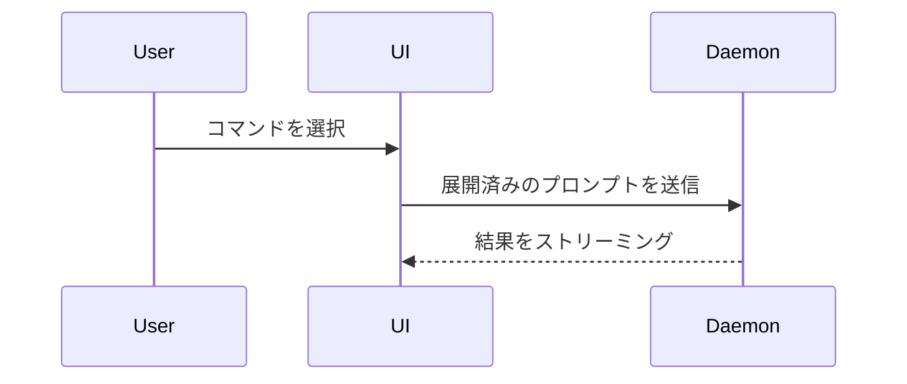

会話中の話題を、ユーザーが視覚的に理解できるようにする。前置きは省き、文章は簡潔にする。要点が明確に伝わる最小限の表現形式を選ぶ。

- ロジックやアルゴリズムは擬似コードで示す。

```text
on(save)
  if content is unchanged
    return cached result
  write new content
  return fresh result
```

- 実行時の制御フローは呼び出しツリーで示す。

```text
submitForm
  createSession
    persistPrompt
    launchAgent
  navigateToSession
```

- UI の構造はコンポーネントツリーで示し、重要な状態とモジュール境界も含める。

```tsx
<SessionPage> (apps/example/src/routes/session.tsx)
  useSessionEvents()
  <SessionToolbar>
    <RunSkillButton> (packages/ui)
```

- ファイルごとの責務や広範なリファクタリングは、浅いファイルツリーで示す。

```text
src/
├── commands/       # ユーザー操作を解析
├── sessions/       # セッション状態を管理
└── transport/      # API リクエストを送信
```

- コンポーネント間の連携、制御フロー、データフローは Mermaid で示す。



- 変更箇所そのものを示すことが目的で、周辺の構造がすでにある場合は `diff` を使う。話題に合う見せ方を選ぶ。

コンポーネントを変更する場合：

```diff
 <SessionPage>
   useSessionEvents()
   <SessionToolbar>
+    <RunSkillButton />
   <SessionTimeline>
+    <SkillResultCard />
```

ファイル構成を変更する場合：

```diff
 src/
 ├── commands/
+│   └── show-me.ts       # スラッシュコマンドを展開
 ├── sessions/
-└── transport.ts
+└── transport/
+    ├── client.ts
+    └── stream.ts
```

呼び出しツリーまたはコールスタックを変更する場合：

```diff
 submitForm
   createSession
     persistPrompt
+    expandSkillMention
     launchAgent
-  navigateToSession
+  navigateToSession
+    subscribeToEvents
```

状態または制御フローを変更する場合：

```diff
 on(save)
-  write content
+  if content is unchanged
+    return cached result
+  write new content
+  invalidate cache
```

- 大部分が新規の場合、文脈を省くと責務や順序が分からなくなる場合、またはユーザーがコピー可能な完成形を必要としている場合は、ブロック全体を示す。

```ts
function expandSkill(command: string): string {
  const skillName = command.slice(1)
  return `use the ${skillName} skill`
}
```

- UI の見た目、レイアウト、状態の比較、または Mermaid に詰め込むには複雑すぎる概念には、一つの論点に絞った HTML ファイルを作成する。図、インフォグラフィック、短いスライド資料から、論点に合う形式を選ぶ。実際のラベルとデータを使い、製品の配色、タイポグラフィ、余白、コンポーネントに合わせ、デスクトップとモバイルの両方に対応する。作成後、そのファイルをユーザーに見せるために開く。

```
Bash(open path/to/show-me-{description}.html)
```

### 指針

各ビジュアルは、対応する短い説明の近くに置く。ユーザーの現在の質問に答えるため、または現在の論点を解決する選択肢を示すために必要な、呼び出し、ファイル、props、状態、境界だけを残す。

これらの表現は一つだけ使っても、複数を組み合わせてもよい。すべてを使うことはほとんどない。状況に応じて判断し、情報を詰め込みすぎない。
